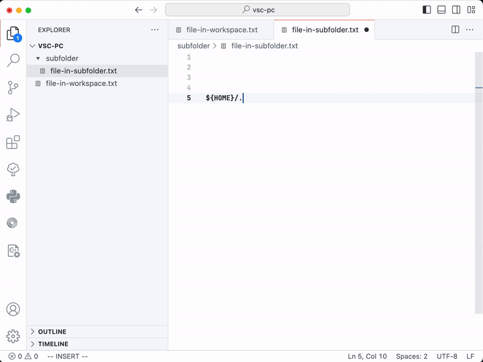

# Visual Studio Code — Path Completer plugin

# Alternatives
If you accidently found this repository, please refer to better alternatives first:
- [Path Autocomplete](https://github.com/mihai-vlc/path-autocomplete)
- [Path Intellisence](https://github.com/ChristianKohler/PathIntellisense)

## What is this plugin about?

The plugin triggers autocompletion for file paths when you type `/`. There are four different sources of completion implemented.
- Root, just type `/` and you'll see all the subdirectories. It has a hint sign `[/]` in the beginning of a suggestion.
- Workspace directory or the the directory containing the opened file, just type `./` and you'll see these suggestions. Hints `[w]` and `[f]` help to recognise where the suggestion comes from.
- Your custom variables (you may set them up in the settings). Type `${yourvariable}/` and you'll see suggestions.

All of the options might be configured, here is the example config
```json
{
  "pathcompleter.useCurrentFileDir": true,
  "pathcompleter.useCurrentWorkspace": true,
  "pathcompleter.useRoot": true,
  "pathcompleter.customPaths": [
    {
      "path": "/Users/<username>",
      "variable": "HOME"
    }
  ],
}
```



## I type a path but suggestions do not appear, why?

There is a couple of not obvious nuances:
- It may not work if you already have a specific plugin for the filetype and this kind of suggestion. For example, if you use [cland plugin](https://github.com/clangd/vscode-clangd) for C++ project and start typing `#include "./"`, no suggest comes from path completer because options from clangd are more suitable. For more details refer to [this comment](https://github.com/microsoft/vscode/issues/107343#issuecomment-698195033).
- Autosuggest is being triggered only in the certain situations and after typing '/'. It covers most of the cases where it's really needed:
  - In the beginning of line — `/usr/...`
  - In single or double quotes — `anytext "/usr/..."`
  - After the equals sign — `anytext=/usr`

## What environments are supported?

Currently it's tested on OSX only. I pretty sure it works on most unix-based system but not on Windows. I personally don't use it, PR-welcome.

## How do I get started?

Currently the plugin is not published to Visual Studio Code store. You may build and install it manually ([details](https://code.visualstudio.com/api/working-with-extensions/publishing-extension#vsce)). Clone the repository, then execute inside:
1. `npm install` — install the dependencies
2. `npm install -g @vscode/vsce` — install the vscode command line packager
3. `npm run test` — check all tests are passed
4. `vsce package` — build the extension
5. `code --install-extension pathcompleter-<verson>.vsix` — install the plugin

## TODO

- [ ] Use environment variables for completion
- [ ] Add a `tigger path suggest`-command

